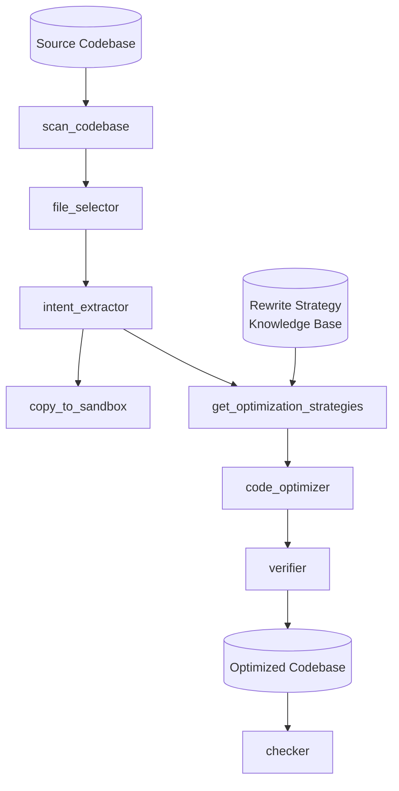
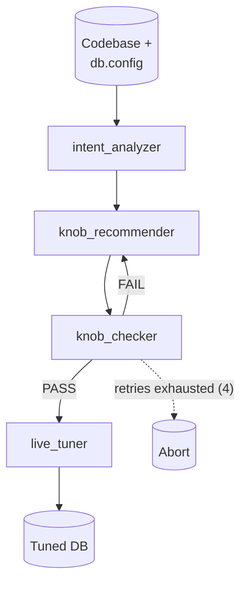

# ADCo: Application-Database Co-design

Jointly analyzes application code and database interactions to find optimizations invisible to either layer alone: scan any codebase, extract DB intent, apply rewrite strategies from a knowledge base, generate optimized code.

## App Layer Optimization Pipeline



An orchestrator agent (`adco_rewriter`) drives the pipeline, calling exactly one tool at a time. Only files flagged in `optimization_targets` are modified; every step is recorded in telemetry; non-zero exit on verifier FAIL.

## Code Rewriter

**Deterministic tools:** `scan_codebase` (token-efficient file listing) · `copy_to_sandbox` (isolated copy + import rewrite) · `get_optimization_strategies` (keyword-match intent against knowledge base).

**LLM sub-agents:** `file_selector` (pick DB-relevant files) → `intent_extractor` (structured DB patterns) → `code_optimizer` (apply strategies; tags every changed file with `# ADCO_OPTIMIZED:` / `-- ADCO_OPTIMIZED:`) → `verifier` (syntax check + app startup check).

## Code Checker

Read-only post-hoc audit of the sandbox. Finds files tagged `ADCO_OPTIMIZED`, reads each change, scores it across five categories (`correctness`, `safety`, `regression`, `completeness`, `performance_regression`) at low/medium/high/critical severity. Verdict: PASS = clean · WARN = only low/medium · FAIL = any high/critical. Emits structured JSON, recorded in telemetry.

## DB Layer Optimization Pipeline



An orchestrator agent (`knob_tuner`) tunes live database configuration knobs instead of rewriting code.

## Knob Tuner

`intent_analyzer` extracts schema, current knobs, hardware capacity, and workload patterns → `knob_recommender` proposes tuned knobs within the hardware budget → `knob_checker` validates in staging (apply, restart, health/CRUD), looping back to recommendation up to 4 total attempts → only on PASS does `live_tuner` apply dynamic knobs to production and queue restart-required knobs for a maintenance window. Supports Postgres/MySQL; `--dry-run` simulates without touching the live DB. Outputs to `out/knob_tuner/`.

## Usage

```bash
make rewrite    DIR=benchmarks/tools/tpcc   # optimize code
make check      DIR=out/<sandbox-id>        # safety audit
make knob-tune  DIR=benchmarks/tools/tpcc DB_TYPE=postgres   # tune DB config knobs

uv run pytest                              # tests
```

`make knob-tune` requires `DB_TYPE` (postgres/mysql); `make rewrite`/`make check` take only `DIR`. Model defaults to `gemini-3.5-flash-lite`.

## Benchmarks

Benchmark repos are cloned into `benchmarks/tools/` and benchmarked against baseline vs. optimized database configs:

```bash
benchmarks/run0_download_benchmarks.sh          # clone tpcc + smallbank repos
benchmarks/run2_tpcc.sh                         # TPC-C: baseline vs. production .dat
benchmarks/run1_smallbank.sh                    # SmallBank: baseline vs. production .dat
```

Both benchmark scripts require a `db.config` in the target tool dir (see `benchmarks/baseline.config`, set up via `benchmarks/helpers/setup_baseline.sh` / `setup_production.sh`). Results land in `out/tpcc/` and `out/smallbank/`.
