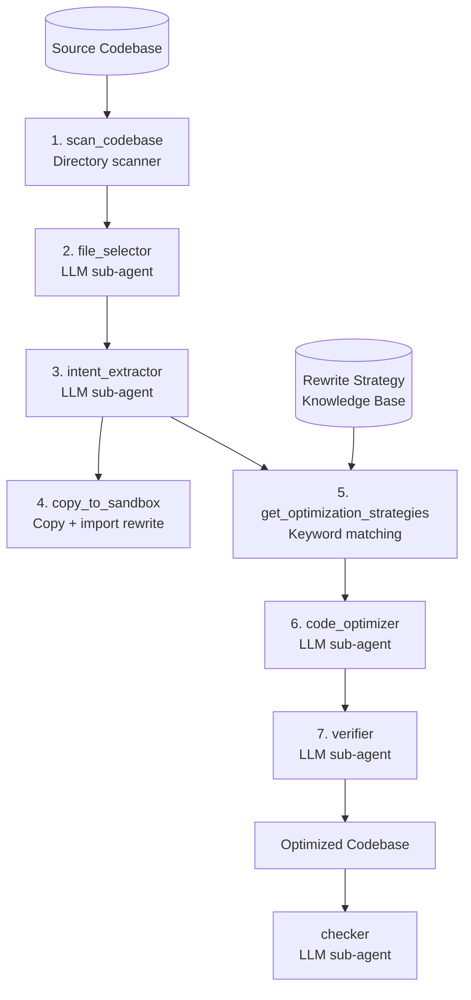

# adco — Application-Database Co-design

Application-Database Co-design (ADCo): jointly analyze **application code** and **database interactions** to find optimization opportunities invisible to either layer in isolation.

Scan any codebase, detect DB interactions, extract intent, apply rewrite strategies from the knowledge base, and generate optimized code.

## Rewriter pipeline



### Steps

1. **scan_codebase** — Walk the target directory, produce a file listing.
2. **file_selector** — Select database-relevant files and the application entry point.
3. **intent_extractor** — Extract structured DB patterns: connection, queries, transactions, N+1 risks, concurrency, ORM usage, and optimization targets.
4. **copy_to_sandbox** — Copy the codebase into an isolated sandbox and rewrite import paths for the flattened layout.
5. **get_optimization_strategies** — Keyword-match the extracted intent against the rewrite strategy knowledge base to pick applicable strategies.
6. **code_optimizer** — Apply selected strategies to the target files in the sandbox (N+1 batching, predicate pushdown, combining queries, etc.).
7. **verifier** — Syntax-check modified files and confirm the sandbox application starts without crashing.

### Rewriter

A root orchestrator agent (`adco_rewriter`) drives the pipeline, calling **exactly one tool at a time** and waiting for the result before continuing. Steps are a mix of deterministic tools (no LLM) and delegated LLM sub-agents:

**Deterministic tools:**
1. **scan_codebase** — Walks the target directory, skipping non-code dirs (`.git`, `.venv`, `node_modules`, …), and returns a token-efficient file listing with metadata.
2. **copy_to_sandbox** — Copies the codebase into an isolated `sandbox/<id>/` directory and rewrites import paths for the flattened layout (strips the project-root prefix and package name from `from pkg import …` / `import pkg.sub` / `__import__` calls).
3. **get_optimization_strategies** — Parses the knowledge base (`docs/kb/query_rewrite_methods.md`) into structured `StrategyDef` objects and keyword-matches the extracted intent against them (e.g. "n+1" / "loop" → COMBINING_QUERIES, "filter" → PREDICATE_PUSHDOWN). Picks the top 5, with boosts for high-impact strategies.

**LLM sub-agents (delegated via ADK `AgentTool`):**
1. **file_selector** — Chooses the DB-relevant files and the app entry point from the listing.
2. **intent_extractor** — Reads the selected files and emits structured DB intent: connection, queries, transactions, N+1 risks, concurrency, ORM usage, and `optimization_targets`.
3. **code_optimizer** — Loads the intent + strategies, reads each target file from the sandbox, writes optimized versions back, and returns `modified_files` + summary. Every written `.py`/`.sql` file is syntax-checked before committing and gets an `# ADCO_OPTIMIZED:` / `-- ADCO_OPTIMIZED:` provenance tag (which the checker later uses).
4. **verifier** — Syntax-checks modified files, then launches the sandbox app to confirm clean startup (`STARTED_OK`); a missing DB server (`STARTUP_FAILED_ENV:DB`) is treated as PASS since the code loaded and initialized correctly. Emits a structured verdict: `status` (PASS/FAIL), `category`, `reason`, `detail`.

The pipeline preserves all existing functionality — only files flagged in `optimization_targets` are modified. Every step's output and token usage is recorded in telemetry, and the pipeline exits non-zero if the verifier reports FAIL.

### Checker

A post-hoc audit sub-agent (not part of the rewriter pipeline) that reviews the optimized sandbox and produces a structured verdict (PASS/WARN/FAIL). The rewriter's code optimizer tags every changed file with an `# ADCO_OPTIMIZED:` (Python) or `-- ADCO_OPTIMIZED:` (SQL) provenance comment, which the checker uses to locate the diff.

The checker is read-only and inspects the sandbox with three tools:

1. **find_modified_files** — Scans the sandbox for the `ADCO_OPTIMIZED` provenance tag to find exactly what the rewriter changed.
2. **read_file** — Reads any sandbox file with line numbers (capped at 50 KB; path traversal is rejected).
3. **list_sandbox** — Lists the full sandbox tree, marking modified files with `*`, to spot untagged files that may still be relevant.

**Process:** find modified files → read *every* modified file (none skipped) → analyze each change line by line against five categories → emit structured JSON.

**Categories** (each with `low`/`medium`/`high`/`critical` severity):
- `correctness` — wrong query semantics, broken control flow, inverted conditions
- `safety` — SQL injection, hardcoded secrets, unsafe deserialization, command injection
- `regression` — changed signatures, removed error handling, different return types
- `completeness` — stub implementations, TODOs, dangling imports, unfinished refactors
- `performance_regression` — N+1 queries, removed caching/pooling, sync instead of async

**Verdict rules:** `PASS` = zero issues; `WARN` = only low/medium severity; `FAIL` = any high/critical issue.

**Output:** `CheckerOutput` JSON — `status`, `issues` (file, line, severity, category, description, suggestion), and `summary`. Runs are recorded in telemetry (`checker_runs` table) and printed to the console as `Result: PASS/WARN/FAIL`.

## Usage

### Single pipeline (via Make)

```bash
make rewrite DIR=benchmarks/tpcc          # optimize code
make check   DIR=sandbox/<sandbox-id>     # safety audit
make tpcc    DIR=sandbox/<sandbox-id>     # benchmark (TPC-C)
make smallbank DIR=sandbox/<sandbox-id>   # benchmark (SmallBank)
```

### Batch experiments

Run 10 experiments with automatic sandbox parsing and cooldown between runs:

```bash
uv run python scripts/run_experiments.py --type tpcc      --runs 10
uv run python scripts/run_experiments.py --type smallbank --runs 10

# Both back-to-back (20 total)
uv run python scripts/run_experiments.py --type both      --runs 10

# Custom delay and model
uv run python scripts/run_experiments.py --type tpcc --runs 10 --delay 60 --model gemini-2.5-pro
```

Per-experiment pipeline: rewrite → check → benchmark. Timestamps and results are printed as a summary table and saved to `scripts/results/experiments_<type>_<timestamp>.csv`.
