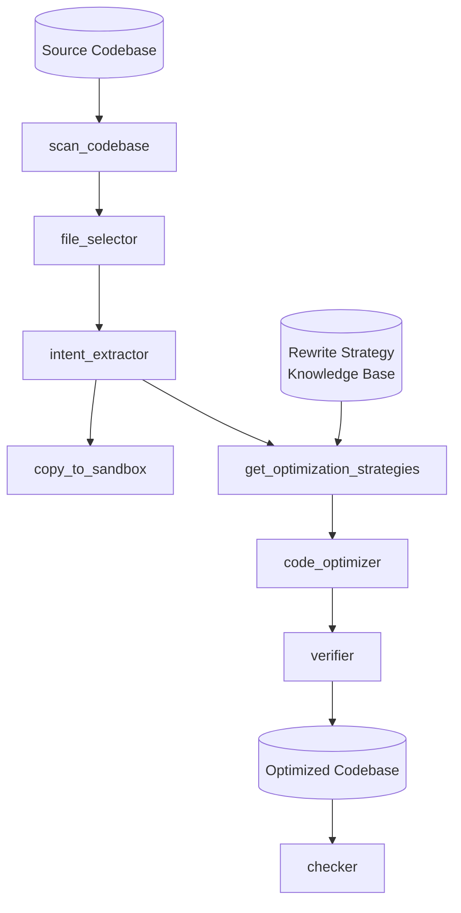

# ADCo: Application-Database Co-design

Jointly analyzes application code and database interactions to find optimizations invisible to either layer alone: scan any codebase, extract DB intent, apply rewrite strategies from a knowledge base, generate optimized code.

## Pipeline



An orchestrator agent (`adco_rewriter`) drives the pipeline, calling exactly one tool at a time.

**Deterministic tools:** `scan_codebase` (token-efficient file listing) · `copy_to_sandbox` (isolated copy + import rewrite) · `get_optimization_strategies` (keyword-match intent against knowledge base).

**LLM sub-agents:** `file_selector` (pick DB-relevant files) → `intent_extractor` (structured DB patterns) → `code_optimizer` (apply strategies; tags every changed file with `# ADCO_OPTIMIZED:` / `-- ADCO_OPTIMIZED:`) → `verifier` (syntax check + app startup check).

Only files flagged in `optimization_targets` are modified. Every step is recorded in telemetry; non-zero exit on verifier FAIL.

## Checker

Read-only post-hoc audit of the sandbox. Finds files tagged `ADCO_OPTIMIZED`, reads each change, scores it across five categories (`correctness`, `safety`, `regression`, `completeness`, `performance_regression`) at low/medium/high/critical severity. Verdict: PASS = clean · WARN = only low/medium · FAIL = any high/critical. Emits structured JSON, recorded in telemetry.

## Usage

```bash
make rewrite DIR=benchmarks/tools/tpcc   # optimize code
make check   DIR=output/<sandbox-id>         # safety audit
make tpcc    DIR=output/<sandbox-id>         # benchmark (TPC-C)
make smallbank DIR=output/<sandbox-id>       # benchmark (SmallBank)

uv run pytest                                # tests
```

Batch experiments — each run goes rewrite → check → benchmark:

```bash
uv run python scripts/run_experiments.py --type tpcc      --runs 10
uv run python scripts/run_experiments.py --type smallbank --runs 10
uv run python scripts/run_experiments.py --type both      --runs 10   # 20 total
```

Options: `--delay <sec>` cooldown between runs, `--model <model>`. Results print as a summary table and save to `scripts/results/experiments_<type>_<timestamp>.csv`.
