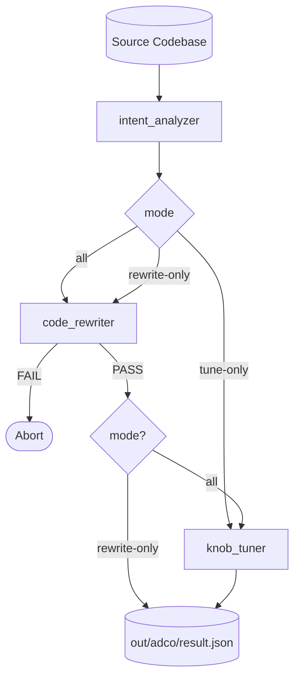
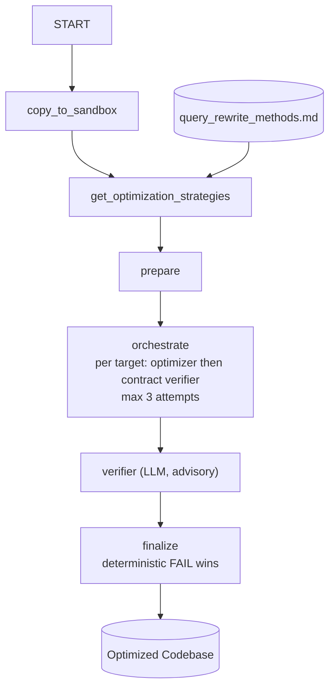
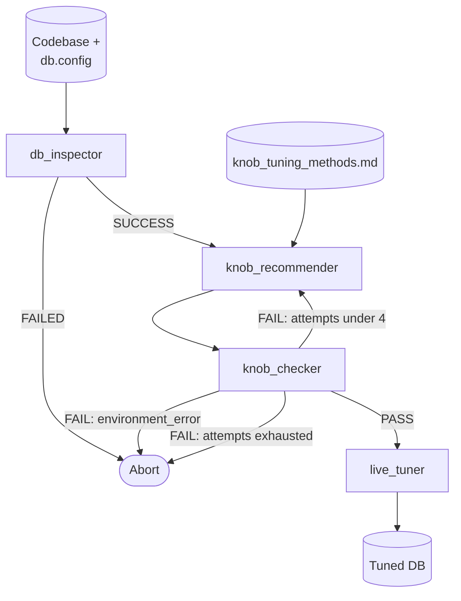

# ADCo: Application-Database Co-design

Jointly analyzes application code and database interactions to find optimizations invisible to either layer alone: scan any codebase, extract DB intent, apply rewrite strategies from a knowledge base, generate verified optimized code, and tune database configuration knobs.

## Source Layout

```
src/
├── adco/               # Unified pipeline: intent_analyzer → code_rewriter → knob_tuner
├── intent_analyzer/    # Phase 1 — scan codebase, select DB-relevant files, extract intent
│   └── sub_agents/        file_selector, intent_extractor
├── code_rewriter/      # Phase 2 — deterministic rewrite workflow
│   ├── workflow.py        START → copy → strategies → prepare → orchestrate → verifier → finalize
│   ├── tools/             copier, planner, AST analysis, dependency graph, rewrite_contract/contract_verifier, SQL analysis
│   └── sub_agents/        optimizer, verifier
├── code_checker/       # Post-hoc safety audit of the optimized sandbox
└── knob_tuner/         # Phase 3 — database configuration knob tuning
    ├── tools/             DB connector, Docker staging, benchmarks, KB planner
    └── sub_agents/        db_inspector, knob_recommender, knob_checker, live_tuner

knowledge_base/
├── query_rewrite_methods.md   # 29 rewrite strategies (combining, N+1 elimination, batching, pushdown, …)
└── knob_tuning_methods.md     # Postgres/MySQL knob tuning strategies
```

## Unified Pipeline



`src.adco` runs phases in order under `--mode=all|rewrite-only|tune-only`: intent is always extracted first; `code_rewriter` runs for `all`/`rewrite-only` and a FAIL aborts before tuning; `knob_tuner` runs for `all`/`tune-only`. Outputs are combined into `out/adco/result.json`.

## Intent Analyzer

An LLM orchestrator runs three steps in sequence: `scan_codebase` (token-efficient file listing) → `file_selector` (pick DB-relevant files: drivers, schemas, queries, entry points) → `intent_extractor` (structured optimization targets + workload profile). Stores `intent_output` and `workload_info` in session state; consumed by both the rewriter (to build rewrite contracts) and the knob tuner (workload context).

## Code Rewriter

A **deterministic ADK `Workflow`** (not an LLM orchestrator) drives rewriting:



**Deterministic tools:** `copy_to_sandbox` (isolated copy under `out/` + import rewrite) · `get_optimization_strategies` (keyword-match intent against `knowledge_base/query_rewrite_methods.md`) · `build_contracts_from_intent` (AST analysis + dependency-graph slicing → one `RewriteContract` per target function) · `verify_contract_target` (strict-zero rewrite contract: no per-row DB calls left in loops — a set-based `IN`/`ANY` batch read may run once per group — signature/return-shape preserved, SQL sanity checks).

**LLM sub-agents:** `optimizer` applies strategies per target function, retrying up to 3 attempts against `verify_contract_target`; tags every changed file with `# ADCO_OPTIMIZED:` / `-- ADCO_OPTIMIZED:` · `verifier` performs a final advisory review.

**Verdict composition:** deterministic verification is authoritative — a FAIL can never be overridden into a PASS by the LLM review, and LLM warnings on a deterministic PASS never change the status. Non-zero exit on FAIL.

## Code Checker

Read-only post-hoc audit of the sandbox. Finds files tagged `ADCO_OPTIMIZED`, reads each change (optionally diffing against `--original`), scores issues across five categories (`correctness`, `safety`, `regression`, `completeness`, `performance_regression`) at low/medium/high/critical severity. Verdict: PASS = clean · WARN = only low/medium · FAIL = any high/critical. Emits structured JSON to `out/code_checker/result.json`.

## Knob Tuner



An LLM orchestrator (`knob_tuner`) coordinates four sub-agents: `db_inspector` extracts schema, current knobs, hardware capacity, and workload patterns → `knob_recommender` proposes tuned knobs within the hardware budget (from `knowledge_base/knob_tuning_methods.md`) → `knob_checker` runs 5-step staging validation (baseline sysbench → apply knobs → restart → health/CRUD checks → tuned sysbench), looping back up to 4 total attempts → only on PASS does `live_tuner` apply dynamic knobs to production and queue restart-required knobs for a maintenance window. Supports Postgres/MySQL; `--dry-run` simulates without touching the live DB. Outputs to `out/knob_tuner/`.

## Usage

```bash
make run           DIR=benchmarks/tools/tpcc SANDBOX_DIR=out/tpcc DB_TYPE=postgres DB_NAME=tpcc   # full pipeline
make rewrite-only  DIR=benchmarks/tools/tpcc SANDBOX_DIR=out/tpcc            # intent + rewrite
make tune-only     DIR=benchmarks/tools/tpcc DB_TYPE=postgres DB_NAME=tpcc   # intent + tune

make intent-analyze DIR=benchmarks/tools/tpcc    # Phase 1 only
make check           DIR=out/<sandbox-id>        # safety audit
make knob-tune       DIR=benchmarks/tools/tpcc DB_TYPE=postgres DB_NAME=tpcc  # Phase 3 only

uv run pytest                                    # tests
```

Model defaults to `gemini-3.5-flash-lite`. `rewrite-only`/`tune-only` go through `src.adco` modes; `check`/`knob-tune`/`intent-analyze` run individual modules directly.

## Benchmarks

Benchmark repos are cloned into `benchmarks/tools/` and benchmarked against baseline vs. optimized database configs:

```bash
benchmarks/run0_download_benchmarks.sh          # clone tpcc + smallbank repos
benchmarks/run0.sh                              # TPC-C: baseline vs. optimized
benchmarks/run_tpcc.sh <baseline|tpcc>          # run one side
```

Benchmarks require a `db.config` in the target tool dir (`benchmarks/tools/<tool>/db.config`). Results land in `results/` and `out/<tool>/`.
